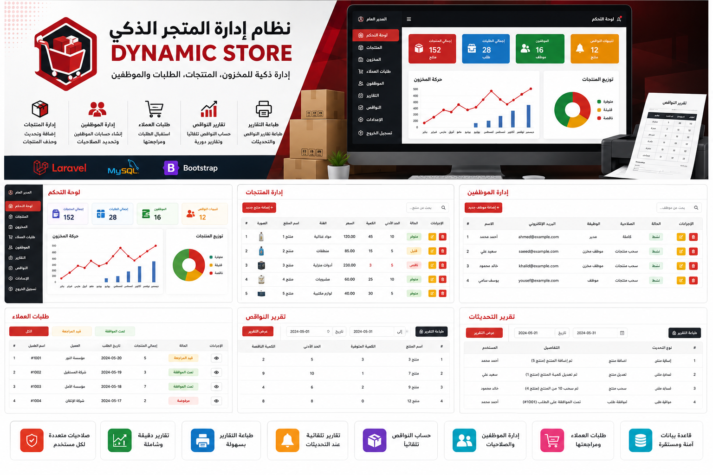

<div align="center">


# 🏪 Dynamic Store Management System

### Smart Inventory & Store Management Platform Built with Laravel

<p align="center">

</p>

<p align="center">


</p>

A complete inventory and store management system designed to streamline product management, employee permissions, customer orders, and inventory reporting.

</div>

---

# 📖 Overview

Dynamic Store Management System is a full-stack Laravel application developed to simplify inventory management and store operations.

The system enables administrators to manage products, employees, customers, inventory levels, and purchase requests through a centralized dashboard. It also automates inventory monitoring by generating shortage reports and keeping stock information up to date.

Role-based permissions ensure that each user only has access to the features required for their responsibilities.

---

# ✨ Features

## 👨‍💼 Administrator

* Product Management (CRUD)
* Employee Management
* Customer Management
* Order Approval System
* Inventory Monitoring
* Automatic Shortage Detection
* Stock Reports
* Printable Reports
* Dashboard Analytics
* Role Management

---

## 👷 Employee

* Secure Login
* View Available Products
* Withdraw Products
* Limited Permissions
* Inventory Updates

---

## 👤 Customer

* Register & Login
* Browse Products
* Create Product Requests
* Track Order Status
* Wait for Admin Approval

---

# 📦 Inventory System

* Automatic Stock Tracking
* Low Stock Detection
* Inventory Updates
* Product Availability
* Printable Inventory Reports

---

# 🛠 Tech Stack

### Backend

* Laravel
* PHP

### Database

* MySQL

### Frontend

* Blade
* Bootstrap
* HTML5
* CSS3
* JavaScript

---

# 🏗️ System Roles

```text
Administrator
      │
      ├── Products
      ├── Employees
      ├── Customers
      ├── Orders
      ├── Reports
      └── Inventory

Employee
      │
      └── Withdraw Products

Customer
      │
      └── Submit Product Requests
```

---

# 📂 Project Structure

```text
Dynamic-Store/

├── app/
├── bootstrap/
├── config/
├── database/
├── public/
├── resources/
├── routes/
├── storage/
├── assets/
└── README.md
```

---

# 🚀 Installation

Clone the repository

```bash
git clone https://github.com/Ahmred0000/Dynamic_Store.git
```

Install dependencies

```bash
composer install
```

Install frontend packages

```bash
npm install
```

Generate application key

```bash
php artisan key:generate
```

Run migrations

```bash
php artisan migrate
```

Start the development server

```bash
php artisan serve
```

---

# 📸 Screenshots

## Dashboard


---

# 📊 Core Modules

* Authentication & Authorization
* Inventory Management
* Employee Management
* Product Management
* Customer Requests
* Order Approval Workflow
* Reporting System
* Role-Based Access Control (RBAC)

---

# 🔮 Future Improvements

* Barcode Scanner Integration
* QR Code Support
* Email Notifications
* SMS Notifications
* Sales Analytics Dashboard
* Multi-Store Support
* REST API
* Mobile Application

---

# 🤝 Contributing

Contributions are welcome.

Feel free to fork the repository and submit a Pull Request.

---

# 📄 License

MIT License

---

# 👨‍💻 Author

Ahmed Ashraf

GitHub

https://github.com/Ahmred0000

---

<div align="center">

### ⭐ If you like this project, don't forget to leave a Star!

</div>
